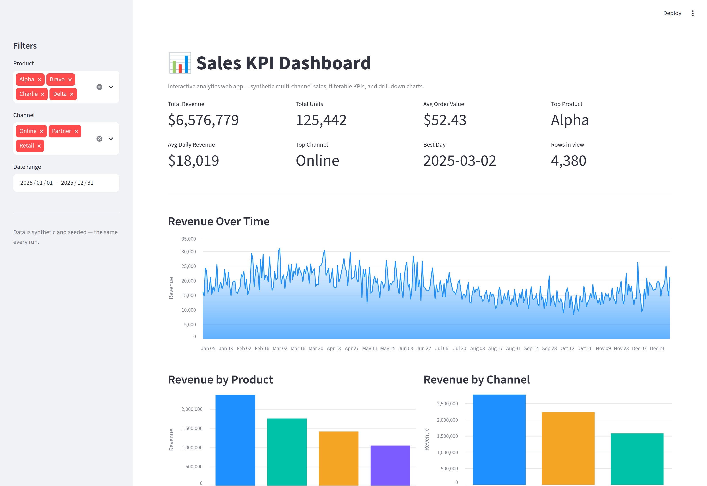

# 📊 Sales KPI Dashboard

> An interactive, browser-based analytics **web app** built with Streamlit —
> filterable KPI cards, a seasonal revenue time series, and product/channel
> breakdowns. The self-service dashboard pattern I build to complement Power BI,
> delivered as a standalone web app.

<p>
  
  
  
  
  
  
</p>

---

## 🖥️ The app

Live screenshot (real browser capture of the running app):



---

## Why this project

A Power BI report lives behind a license and a login. Sometimes you need the same
analytics as a **web app** anyone can open in a browser — filter it, drill into it,
and read the KPIs without a BI seat. This is that: a clean Streamlit dashboard over
a realistic multi-channel sales dataset, with the data/KPI logic split out of the UI
so it is **unit-tested** (a real dashboard's numbers should have tests behind them,
not just charts). The dataset is seeded and cached, so the KPIs stay stable while you
interact — no numbers jumping around on every filter click.

## What it does

- **Filter** by product, channel and date range in the sidebar — every KPI and chart
  recomputes on the filtered slice.
- **8 KPI cards**: total revenue, units, average order value, top product, average
  daily revenue, top channel, best trading day, rows in view.
- **Revenue over time** — a seasonal area chart (yearly cycle + weekend uplift).
- **Revenue by product** and **by channel** — sorted bar breakdowns in house palette.
- **Detail table** of the underlying transactions.

## 📈 Headline KPIs (full dataset, all filters open)

| KPI | Value |
|---|---|
| Total revenue | **$6,576,779** |
| Total units | **125,442** |
| Avg order value | **$52.43** |
| Avg daily revenue | **$18,019** |
| Top product | **Alpha** ($2.37M) |
| Top channel | **Online** ($2.77M) |
| Best day | **2025-03-02** |
| Rows | 4,380 (365 days × 4 products × 3 channels) |

> Numbers are deterministic (seeded generator) — the dashboard shows the same
> figures on every run.

## Methodology

The generator (`data.py`) builds daily sales with structure that makes the analytics
meaningful rather than random:

- **Seasonality** — a sinusoidal yearly cycle (`sin(2π · day/365)`).
- **Weekend uplift** — Sat/Sun demand ×1.18.
- **Demand mix** — per-product multipliers (Alpha 1.35 → Delta 0.60) and per-channel
  multipliers (Online 1.25 → Partner 0.70), so leaders and laggards are consistent.
- **Reproducible** — a per-call seeded `numpy` RNG; the app wraps it in
  `@st.cache_data` so interactions never regenerate the data.

`compute_kpis()` is the single source of truth for the metric cards and is what the
tests assert against.

## ▶️ Run it

```bash
pip install -r requirements.txt
streamlit run app.py
```

Then open the local URL Streamlit prints (usually http://localhost:8501).

## 🧪 Tests

```bash
pytest -q     # 9 tests
```

`tests/test_kpis.py` tests the logic behind the UI: schema and row count, no
negative values, **determinism** (two loads are identical), the KPI identities
(`AOV = revenue / units`, `avg daily revenue = mean of daily sums`), that a filtered
subset is always a strict subset of the total, and that an empty selection degrades
safely instead of throwing.

## 🗂️ Project structure

```
sales-kpi-dashboard/
├── app.py              # Streamlit UI layer (cards, Altair charts, filters)
├── data.py             # data generation + KPI logic (importable / tested)
├── tests/
│   └── test_kpis.py    # pytest — data + KPI invariants
├── docs/               # committed app screenshot + data sample
├── requirements.txt
└── README.md
```

## 🛠️ Stack

`streamlit` · `altair` · `pandas` · `numpy` · `pytest`

---

<sub>Part of my data & analytics portfolio — [github.com/syedjawaadali](https://github.com/syedjawaadali). Data is synthetic; no real data is used.</sub>
